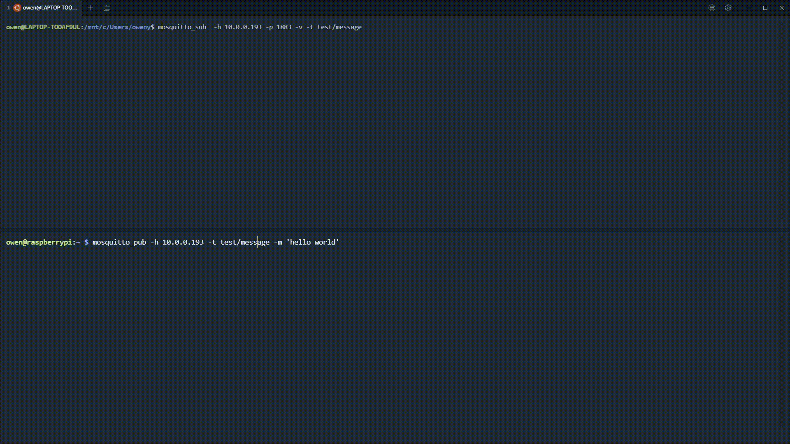

# Install a MQTT Broker on the Raspberry Pi

1. First install

   ```bash
   sudo apt get update
   sudo apt install mosquitto mosquitto-clients
   sudo reboot
   ```

2. Test your installation

   ```bash
   sudo systemctl enable mosquitto
   ```

3. Edit the `mosquitto.conf` file

   ```bash
   sudo nano /etc/mosquitto/mosquitto.conf
   ```

   Replace

   ```
   include_dir /etc/mosquitto/conf.d
   ```

   with

   ```
   allow_anonymous true
   listener 1883
   ```

4. Restart mosquitto service.

   ```bash
   sudo systemctl restart mosquitto
   ```

   The configuration should be applied and the broker will listen on port 1883.

5. To test if you are able to publish/subscribe to your MQTT Broker. Use another computer connected to the same local network.

   ```bash
   sudo apt install mosquitto-clients
   ```

   Subscribe to a topic in one terminal window

   ```bash
   mosquitto_sub  -h <raspberry_pi_ip_address> -p 1883 -v -t test/message
   ```

   Publish to the topic in another terminal window. Replace `<raspberry pi ip address>` with your rasp pi ip address

   ```bash
   mosquitto_pub -h <raspberry_pi_ip_address> -t test/message -m 'Hello World!'
   ```

   You should be able to see a response from the subscribe terminal window! This was my output

   ```bash
   test/message Hello World!
   ```



If you're running into trouble with the test above. you may be experiencing some firewall issues. You can refer to this stack overflow post: [**Stack Overflow - mosquito server refuses connections**](https://askubuntu.com/questions/1121524/mosquito-server-refuses-connections-ubuntu-18-04) .

# References

- [**HIVE MQTT Python Client**](https://www.hivemq.com/blog/mqtt-client-library-paho-python/) - Resource in setting up a MQTT Client with Python

- [**IoT4 Beginners - Install MQTT Broker on Raspberry Pi**](https://iot4beginners.com/mosquitto-mqtt-broker-on-raspberry-pi/) - Helped me get started on installing and setting up my Raspberry Pi

- [**HacksterIO - Running a MQTT Broker on Raspberry Pi**](https://www.hackster.io/dhairya-parikh/running-a-mqtt-broker-on-raspberry-pi-63c348) - Also helped me get started on installing and setting up my Raspberry Pi

- [**Stack Overflow - mosquito server refuses connections**](https://askubuntu.com/questions/1121524/mosquito-server-refuses-connections-ubuntu-18-04) - Helped me figure out how to disable a firewall for port 1883 (the default mqtt broker port)

- [**Stack Overflow - mosquitto client refused connection**](https://stackoverflow.com/questions/24556160/mosquitto-client-obtain-refused-connection) - this guide helped me figure what to add to my `mosquitto.conf` file when I kept getting a `client refused connection` error
