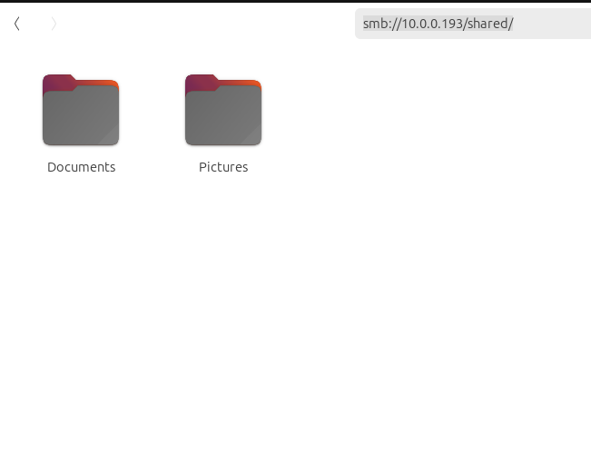
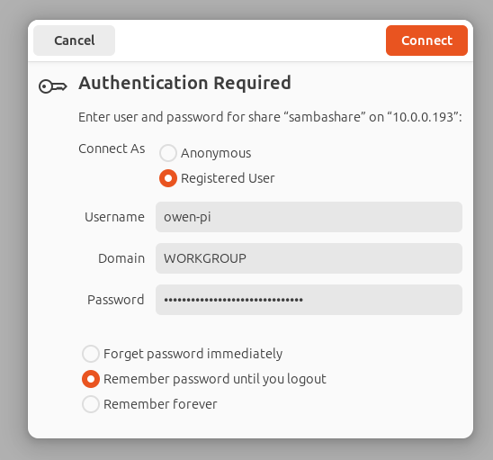

# Raspberry Pi Network Attached Storage

My primary use case for setting up a very basic [NAS](https://en.wikipedia.org/wiki/Network-attached_storage) to back up files from my laptop and other devices to a portable SSD. This is really basic, and there are a lot of enhancements that can be made for sure. If you're interested in those consideration, check out the "Further Reading and Improvements" section below. Otherwise, here's how you build one for yourself!

## Materials Used
****
- Raspberry Pi 4

- [SanDisk Portable Extreme SSD 1TB](https://shop.sandisk.com/products/ssd/portable-ssd/portable-ssd-sandisk-extreme-usb-3-2?sku=SDSSDE61-1T00-G25)

## Prerequisites

- Raspberry Pi is fully setup

  - [Raspberry Pi OS](https://www.raspberrypi.com/software/)

  - Connected to your home/office Network (Ethernet recommended for higher speeds)

  - SSH is enabled

## Step 1 - Find the Block Device

The steps below will help you find your "block" device or the storage device name.

- Connect your Sandisk Portable Extreme SSD to the Raspberry Pi 4 via USB cable

- Then locate the name of the Portable SSD storage device using `lsblk`

- For example

```shell
owen-pi@owen-pi:~ $ lsblk
NAME        MAJ:MIN RM   SIZE RO TYPE MOUNTPOINTS
sda           8:0    0 931.5G  0 disk
└─sda1        8:1    0 931.5G  0 part /mnt/sda1
```

- In the code-block above:

  - `sda1` will be the name you are looking for, this is the **BLOCK NAME**

  - `/mnt/sda` is the mount point, this is the **MOUNT POINT**

## Step 2 - Add a fstab Entry

Setting up [fstab](https://www.howtogeek.com/38125/htg-explains-what-is-the-linux-fstab-and-how-does-it-work/) will ensure that your storage device will be mounted each time. Mounting a storage device will let us interact with its file system.

- Edit `/etc/fstab`

```shell
sudo nano /etc/fstab
```

- Add the `fstab` entry to mount your `/etc/fstab` file
  - replace `${BLOCK_NAME}`  with the BLOCK NAME
  - replace `${MOUNT_POINT}` with the desired MOUNT POINT

```shell
/dev/${BLOCK_NAME} ${MOUNT_POINT} ext4 defaults,noatime 0 1
```

- For example

```shell
/dev/sda1 /mnt/sda1/ ext4 defaults,noatime 0 1
```

- Save and close the file with

```
CTRL + X
```

## Step 3 - Create a shared folder

- reminder: the external drive was mounted to `/mnt/sda1`

```shell
owen-pi@owen-pi:~ $ lsblk
NAME        MAJ:MIN RM   SIZE RO TYPE MOUNTPOINTS
sda           8:0    0 931.5G  0 disk
└─sda1        8:1    0 931.5G  0 part /mnt/sda1
```

- Create a `shared` folder and make it writable/readable
  - replace `${MOUNT_POINT}` with your MOUNT POINT

```shell
mkdir ${MOUNT_POINT}/shared
sudo chmod -R 777 ${MOUNT_POINT}/shared
```

- For example

```shell
mkdir /mnt/sda1/shared
sudo chmod -R 777 /mnt/sda1/shared
```

## Step 4 - Setup Samba

```shell
sudo apt install samba samba-common-bin
```

- edit `/etc/samba/smb.conf`

```shell
sudo nano /etc/samba/smb.conf
```

- Add the following lines to `/etc/samba/smb.conf`
  - replace `${MOUNT_POINT}` with your MOUNT POINT

```shell
[shared]
path=${MOUNT_POINT}/shared
writeable=Yes
create mask=0777
directory mask=0777
public=no
```

- For example

```bash
[shared]
path=/mnt/sda1/shared
writeable=Yes
create mask=0777
directory mask=0777
public=no
```

- Update firewall rules to allow samba traffic

```bash
sudo ufw allow samba
```

- Restart Samba

```shell
sudo systemctl restart smbd
```

## Step 5 - Setup Samba User

- (optional) Create a new user

  - or you can skip this step and use the existing user on your Raspberry Pi

  - replace `${USERNAME}` with your desired username

```shell
sudo useradd ${USERNAME}
```

- Add a user account to Samba

```shell
owen-pi@owen-pi:/mnt/sda1/shared $ sudo smbpasswd -a owen-pi
```

- remember the username and password you set!

## Step 6 - Connecting

To connect on Ubuntu, you can just use the path in your **Files** application:

- replace `${RASPBERRY_PI_IPADDRESS}` with the ip address of your Raspberry Pi

```shell
  smb://${RASPBERRY_PI_IPADDRESS}/shared
```

- Open up Files on Ubuntu and put the path in the search bar



- Login with your username and password from step 5




## Further Reading and Improvements

My primary use case for setting up samba was to back up files from my laptop. To easily sync my files from my laptop to storage device connected to the Raspberry Pi, I used the tool `rclone`. You can find more information about setting up rclone in the [docs](https://rclone.org/smb/). After setting up my config for the samba server I just easily sync using a command like:

```shell
rclone sync -i "/media/owen/Data1/Pictures"  owen-pi-samba:"shared/Pictures"
```

Some further improvements I can do is:

- Use a [Raspberry Pi M.2 HAT+](https://www.raspberrypi.com/products/m2-hat-plus/) with a NVME drive

  - better form factor

- Explore using a RAID configuration

  - this will allow redundancy among multiple storage devices

  - more reading here: https://raspberrytips.com/raid-on-raspberry-pi/

## Other Useful Commands

**View samba users**

```shell
sudo pdbedit -L -v
```

Example:

```
Unix username:        owen-pi
NT username:
Account Flags:        [U          ]
User SID:             *************
Primary Group SID:    *************
Full Name:
Home Directory:       \\OWEN-PI\owen-pi
HomeDir Drive:
Logon Script:
Profile Path:         \\OWEN-PI\owen-pi\profile
Domain:               OWEN-PI
Account desc:
Workstations:
Munged dial:
Logon time:           0
Logoff time:          Wed, 06 Feb 2036 07:06:39 PST
Kickoff time:         Wed, 06 Feb 2036 07:06:39 PST
Password last set:    Tue, 22 Jul 2025 23:13:55 PDT
Password can change:  Tue, 22 Jul 2025 23:13:55 PDT
Password must change: never
Last bad password   : 0
Bad password count  : 0
Logon hours         : FFFFFFFFFFFFFFFFFFFFFFFFFFFFFFFFFFFFFFFFFF
```

**Test Samba Connection**

```shell
sudo apt install smbclient
smbclient //10.0.0.193/shared -U owen-pi
```

## References

- https://www.raspberrypi.com/software/ - download page for Raspberry Pi Software

- [How to build a Raspberry Pi NAS - Raspberry Pi](https://www.raspberrypi.com/tutorials/nas-box-raspberry-pi-tutorial/)

- [Install and Configure Samba | Ubuntu](https://ubuntu.com/tutorials/install-and-configure-samba#1-overview)

- [How to Add or Delete a Samba User Under Linux? – Its Linux FOSS](https://itslinuxfoss.com/add-delete-samba-user-under-linux/)

- [rclone | SMB / CIFS](https://rclone.org/smb/) - how to setup samba configuration with `rclone`
