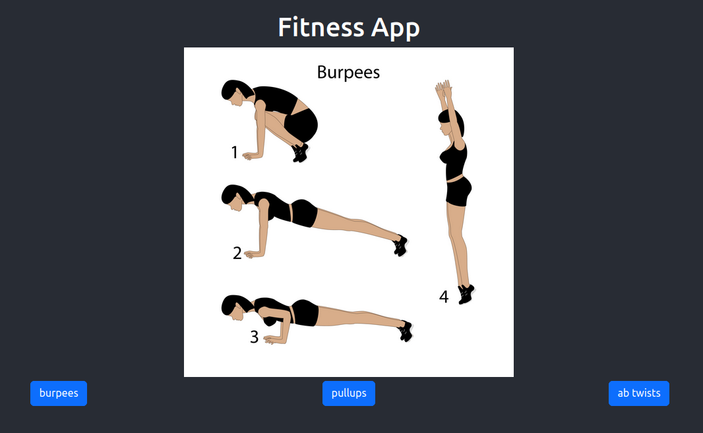
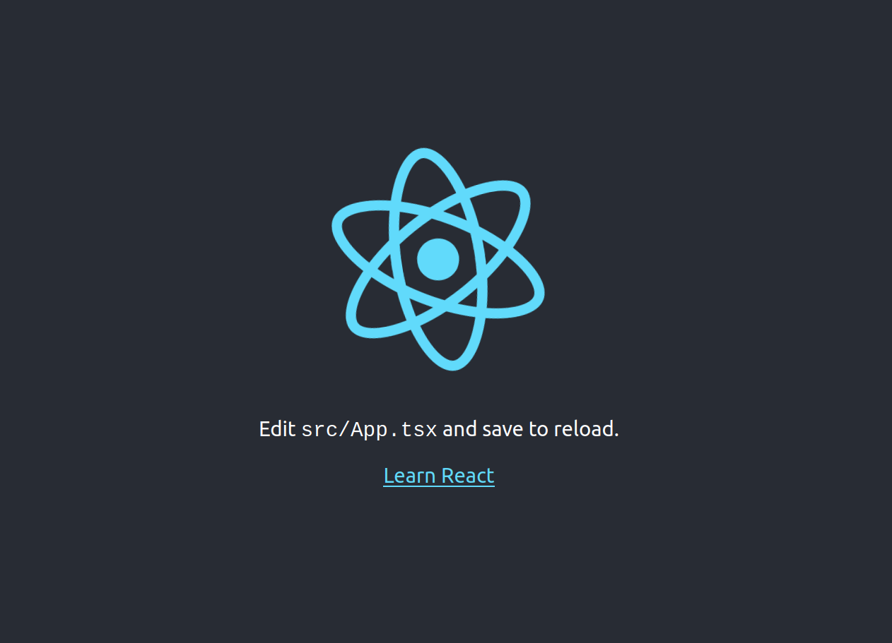
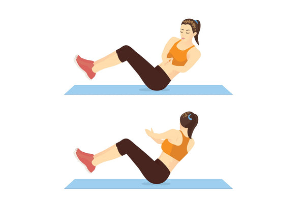
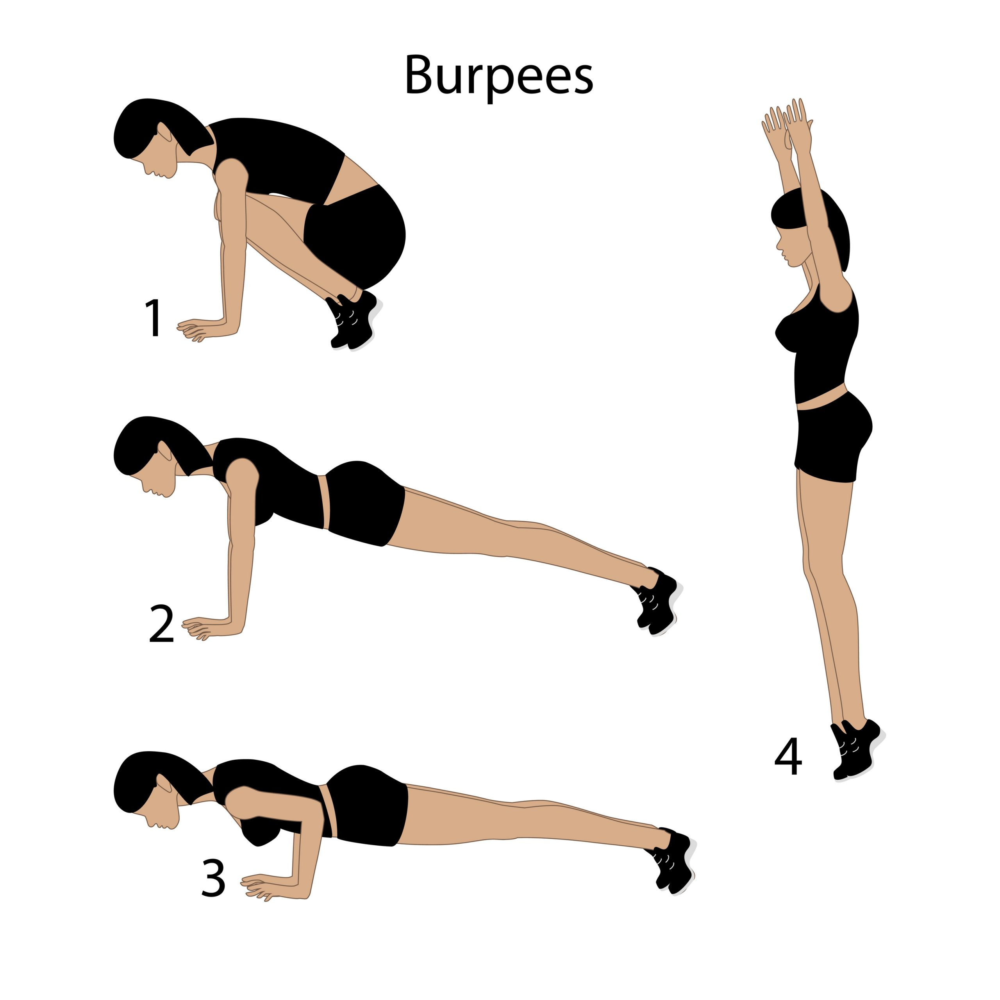
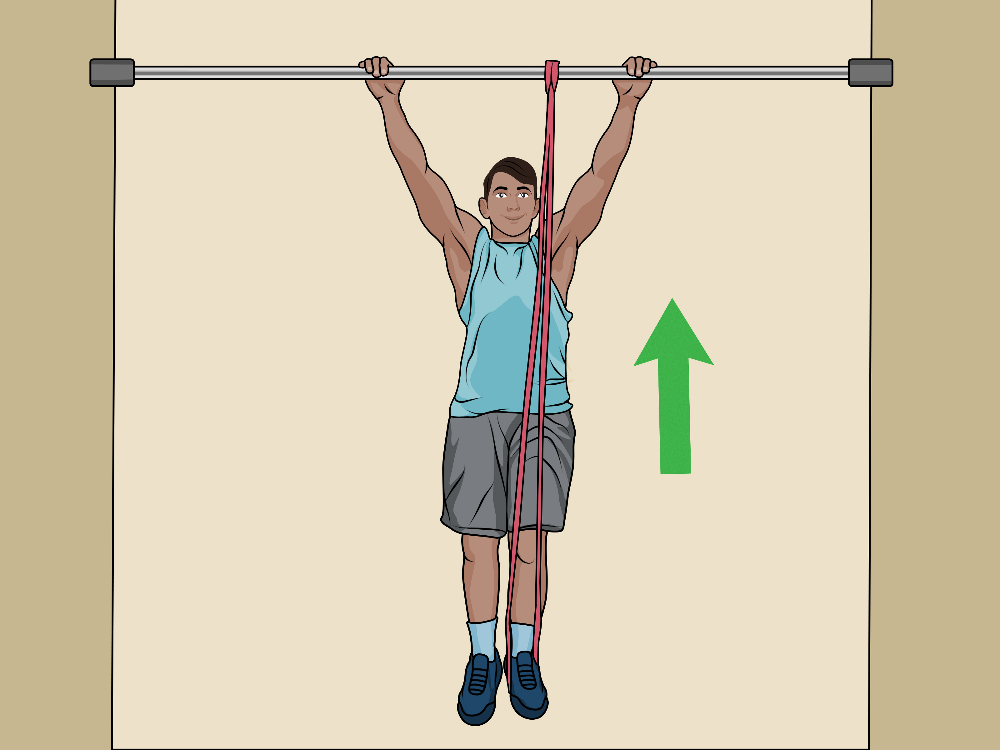

# React Intro - Bad Fitness Workout App

I was just trying to learn react and learn some simple concepts, so I made this very bad fitness page. It's not designed to be a good app, but just designed to help me learn some of the following concepts:

- creating a react app with typescript
- using the [react bootstrap](https://react-bootstrap.github.io/) library
- using the `useState` Hook

## 0 - Preview of what I'm building

Just a simple webpage that displays a picture of how to do an exercise. Users can click on the buttons below to show other instructions of other exercises.

You can view an example of this on the [published replit page](https://replit.com/@okyang/fitness-app-1?v=1).




## 1 - Setup
I use [nvm](https://github.com/nvm-sh/nvm) to help me install `node.js`

```shell
curl -o- https://raw.githubusercontent.com/nvm-sh/nvm/v0.39.5/install.sh | bash
```

Close and re-open your terminal, then run

```shell
nvm install 16.7.0 # this will install a specific version number of node.js
```

Then create a react app with the typescript template

```shell
npx create-react-app fitness-app --template typescript
```

## 2 - Confirm your setup works

You can start to run the react app and preview the page on your local host

```shell
cd fitness-app
npm start
```

This is an example of the page



## 3 - Install React Bootstrap

We'll be using the [React Boostrap Library](https://react-bootstrap.github.io/docs/getting-started/introduction), a CSS framework that helps make frontend design easier. They have a bunch of [components](https://react-bootstrap.github.io/docs/components/accordion) that are easy to use.

Let's install it with the following command=

```shell
npm install react-bootstrap bootstrap
```

## 4 - Adding the images

Let's first add some images of excercises that our webpage can display in a accesible path.


Create a folder `src/images`

```shell
mkdir ./src/images
```

Download the images below and add them to your `./public/assets` folder







## 4 - Creating the Buttons

Let's create a new file just for our buttons. Create a new file `src/ButtonRow.tsx`

```shell
touch src/ButtonRow.tsx
```

Edit the `src/ButtonRow.tsx` file. Let's add the following lines

```typescript
import { Button, Container, Row, Col } from "react-bootstrap";
import { useState } from "react";
import abs from "./images/abtwists.jpeg";
import pullups from "./images/pullup.jpeg";
import burpees from "./images/burpees.jpeg";

```

With the code above we import the following bootstrap components to use
- [Button](https://react-bootstrap.github.io/docs/components/buttons) - bootstrap button components!
- [Container, Row, Col](https://react-bootstrap.github.io/docs/layout/grid#container) - part of the layout grid system

We also are importing the [useState](https://react.dev/reference/react/useState) api that we will be using later.

Now let's add an array of objects representing our exercise images to our file `src/ButtonRow.tsx`

```typescript
const imageSources = [
    {
        imageSrc: "/assets/burpees.png",
        name: "burpees",
        id: 1,
    },
    {
        imageSrc: "/assets/pullup.png",
        name: "pullups",
        id: 2,
    },
    {
        imageSrc: "/assets/abtwists.png",
        name: "ab twists",
        id: 3,
    },
];
```

Now let's add some functions to help us display our images and buttons. I will explain them later.

```typescript
function showImage(imageSrc: string) {
  return (
    <>
      
    </>
  );
}

function ButtonRow() {
    const [imageId, setimageId] = useState(0);
    return (
        <>
            <Container>
                <Row>
                    <Col>{showImage(imageSources[imageId].imageSrc)}</Col>
                </Row>
                <Row>
                    <Col>
                        <Button
                            variant="primary"
                            onClick={() => {
                                setimageId(0);
                            }}
                        >
                            {imageSources[0].name}
                        </Button>
                    </Col>
                    <Col>
                        <Button
                            variant="primary"
                            onClick={() => {
                                setimageId(1);
                            }}
                        >
                            {imageSources[1].name}
                        </Button>{" "}
                    </Col>
                    <Col>
                        <Button
                            variant="primary"
                            onClick={() => {
                                setimageId(2);
                            }}
                        >
                            {imageSources[2].name}
                        </Button>{" "}
                    </Col>
                </Row>
            </Container>
        </>
    );
}
export default ButtonRow;
```

The `showImage` function is purely for just returning the html body for displaying an image. It takes a string `imageSrc` which is just a path to our image. The app finds our `./public/assets` path as `/assets`. So a valid path to one of our images would be `"/assets/pullup.png"`.


The `ButtonRow` function is the main function that will display all our buttons. It also calls the `showImage` function to display our images. We then set up a hook with `imageId`, which will help refer to what image will show based on the `imageSources` variable we created. The `setimageId` will be used to update our state (our `imageId`) by each of our buttons. So an example sequence of events will be:
1. Press the first button
2. `setImageID(1)` is called and will set the `imageId` to be `1`
3. The `showImage(imageSources[imageId].imageSrc)` line will update the image with the image id defined in `imageSources`
4. Since `1` is set, then `/assets/burpees.png` will be displayed

## 5 - Update the Main Page

Now we can update the main page so our buttons and image will show! Replace the contents of `App.tsx` with the following code.

```typescript
import React from "react";
import "./App.css";
import ButtonRow from "./components/ButtonRow";
import "bootstrap/dist/css/bootstrap.min.css";

function App() {
    return (
        <div className="App">
            <header className="App-header">
                <h1>Fitness App</h1>
                {ButtonRow()}
            </header>
        </div>
    );
}

export default App;

```

We import the `ButtonRow` function with the following line `import ButtonRow from "./components/ButtonRow";`. Then we call the `ButtonRow()` function we created using the curly braces in the HTML body `{ButtonRow()}`.

That's it! 🥳

## References

- [React Bootstrap Getting Started](https://react-bootstrap.github.io/docs/getting-started/introduction)
